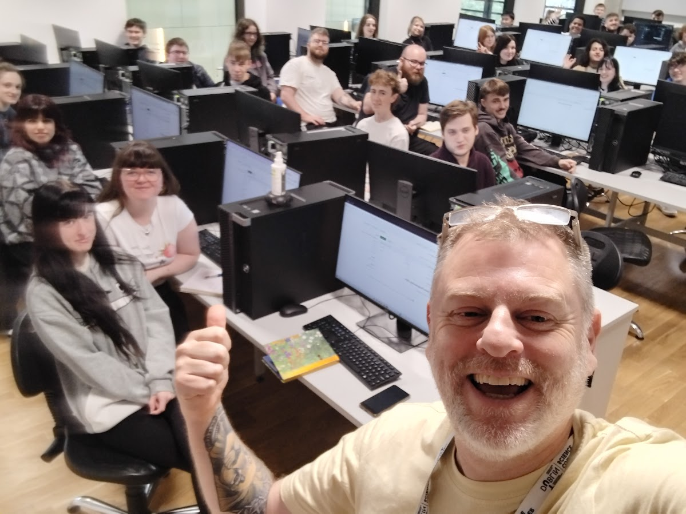

# Game Programming 2024

Welcome to the Metaverse

# Introduction

The aim of this course is to develop core technical skills in coding, digital literacy,  computational thinking, and use of git and other tools, that are used in software development and in the games industry. The course uses Godot Game Engine and github, however I will also show examples using Unity, Python and other relevant tehcnologies. Over the course of the module, students will build a portfolio of work on their github repositories and will have the opportunity to do projects in many creative areas such as art, music and games development. Skills acquired on the module are transferrable to other engines and technologies and provide solid foundation for a future career in game development.

# Structure

Semester 1

Monday:

- 12:00-13:00 - Studio Classroom
- 13:00-14:00 - Time for lunch and engagement with campus activities
- 14:00-17:00 - Studio Classroom

Semester 2

Thursday:

- 12:00-13:00 - Studio Classroom
- 13:00-14:00 - Time for lunch and engagement with campus activities
- 14:00-17:00 - Studio Classroom

*Studio Classroom* means: we work together in a lab class on various topics and projects, building competency through experience, in various areas of software and games development. We will take plenty of breaks to get up and walk around.

At the end of the module, each student will have the ability to develop a complete digital game from scratch incorporating logic, movement and gameplay and manage their work on github.

# Assessment

- End of year programming test 30%
- Weekly engagement mark 20%
- [Assignment 1 25% - Due 9/12/2024](assignments.md)
- [Assignment 2 25% - Due 10/4/2024](assignments.md)

Weekly engagement mark is assessessed automatically by evaluating the number of git commits made each week. 1 commit means 1 mark. 2 commits 2 marks, 3 commits or more full marks each week.

# Resources
- [CSResources git repo](https://github.com/skooter500/csresources/blob/main/git_ref.pdf). Here you will find links to the previous courses and all my quick references
- [Git for poets](https://www.youtube.com/watch?v=BCQHnlnPusY)
- [Godot for beginners](https://www.youtube.com/watch?v=LOhfqjmasi0)
- [GDScript Tutorial](https://www.youtube.com/watch?v=e1zJS31tr88)
- [5 Games Made in Godot to inspire you each week](https://www.youtube.com/@stayathomedev) 
- [Game dev news channel](https://www.youtube.com/@gamefromscratch)
- [Class discord. Important to check this regularly as I share a lot of useful information here](https://discord.gg/3SwfCsH9)
- [Godot discord](https://discord.com/invite/godotengine)
- [Submit your fork of the git repo](https://forms.office.com/Pages/ResponsePage.aspx?id=yxdjdkjpX06M7Nq8ji_V2ou3qmFXqEdGlmiD1Myl3gNUQTMyV1NKWFVUWUwxQjZTS05SRTE1TEUxQi4u)

# Semester 2

## Week 5 - Enemy AI
- [Air Sea Battle](https://www.retrogames.cz/play_349-Atari2600.php)
- [Lab](labs/enemy_ai.md)

## Week 4 - Tweens & Juice
- [Tweens](labs/tweens.md)
- [Tweens lab](labs/tweens_lab.md)

## Week 3
- Shooter Game

## [Shooter Game Exercises](labs/shooter_game_lab.md)

## Week 2 
- More procedural drawing
- [Spirals] - Have a look at the spirals scene!

## [Flowers](labs/flowers_lab.md)

## Week 1 
- [Loops](labs/loops.md)

## Lab:
- [Loops](labs/loops_lab.md)

# Semester 1

## Week 11
- More music Examples
- Demonstration of the shruiti box

## Week 10
- Music examples

## Week 9
- [Movement & collisions]

## Week 8 - Trigonometry
- [Trigonometry Problem Set](https://1.cdn.edl.io/IDqRlI8C9dRkoqehbbdHBrcGT6m87gkCQuMKTkp0U7JvHvuG.pdf)

## Week 7 - Review Week

## Week 6
- Introduction to Vectors

## Week 5
- GodotCon Update - [Check out my pictures](https://photos.app.goo.gl/iUpijUxEwGwgDWnu6)
- Shooter Game
- Check out [GDQuest for amazing free tutorials](https://www.gdquest.com/)!
- Editing Godot projects on Quest 3
- Music stuff

## Week 4
- Yoga
- [Git commands](https://github.com/skooter500/csresources/blob/main/git_ref.pdf)
- Lots of Godot examples in 2D now in the repo to explore
- Space game

## Week 3
- [Godot 2D Nodes video](https://www.youtube.com/watch?v=22VYNOtrcgM)
- Moving a spaceship (code in the repo)

## Week 2
- Godot examples in 2D and 3D 
- Moving a sprite around the screen
- Open source & closed source games engines
- Forking the repo and keeping the fork up to date

## Week 1
- Yoga
- Introductions